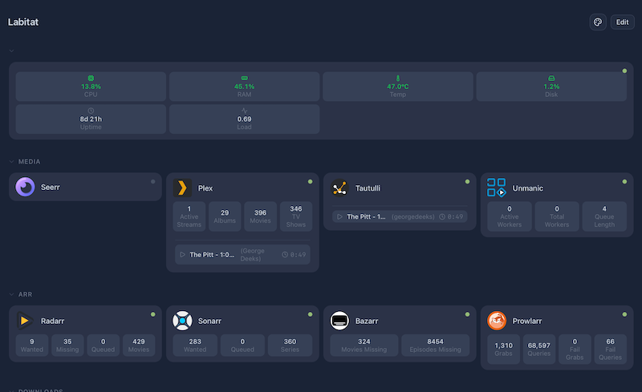

# Labitat

[](https://github.com/DoomedRamen/labitat/actions/workflows/ci-cd.yml)
[](https://opensource.org/licenses/MIT)
[](https://github.com/DoomedRamen/labitat/releases)
[](https://github.com/DoomedRamen/labitat/pkgs/container/labitat)
[](CODE_OF_CONDUCT.md)

A modern, self-hosted homelab dashboard with live service widgets, drag-and-drop layout, and full PWA support.



## Features

- **Live Service Monitoring** — Real-time status and metrics for 20+ services (30+ with experimental adapters)
- **Drag & Drop Layout** — Arrange widgets your way
- **PWA Support** — Install on desktop or mobile for a native app experience
- **Secure by Default** — AES-256-GCM encryption for credentials, HTTP-only sessions
- **Lightweight** — Runs on a Raspberry Pi, scales to full servers
- **Extensible** — Add your own services with a single TypeScript file

## Quick Start

### Docker (Recommended)

No config needed — a secret key is generated automatically on first run.

```bash
docker run -d \
  --name labitat \
  --restart unless-stopped \
  -p 3000:3000 \
  -v labitat_data:/data \
  ghcr.io/doomedramen/labitat:latest
```

Visit `http://localhost:3000` — you'll be guided to create your admin account on first visit.

Or with Docker Compose (downloads just the compose file, no full clone needed):

```bash
curl -fsSL https://raw.githubusercontent.com/DoomedRamen/labitat/main/docker-compose.yml -o docker-compose.yml
docker compose up -d
```

> **Secret key:** Auto-generated on first run and saved to `/data/.secret_key` inside the volume. Back up your `labitat_data` volume to preserve it. To set your own key: `export SECRET_KEY=$(openssl rand -base64 32)` before running.

### Native Install (Debian/Proxmox)

```bash
bash <(curl -s https://raw.githubusercontent.com/DoomedRamen/labitat/main/install.sh)
```

The installer sets up dependencies and the service. Visit the dashboard URL to create your admin account.

### Manual Setup

```bash
pnpm install
pnpm db:push
pnpm build
pnpm start
```

## Supported Services

| Category       | Services                                                            |
| -------------- | ------------------------------------------------------------------- |
| **Downloads**  | Radarr, Sonarr, Prowlarr, qBittorrent, SABnzbd, Bazarr              |
| **Media**      | Plex, Unmanic, Tautulli, Overseerr (Seerr)                          |
| **Networking** | AdGuard Home, Nginx Proxy Manager                                   |
| **Monitoring** | APCUPS, Unifi, Glances                                              |
| **General**    | Open-Meteo Weather, OpenWeatherMap, Date/Time, Search, Service Logo |

### Experimental (Available but Not Manually Tested)

These adapters exist in the codebase but are disabled by default. Enable them by uncommenting the relevant lines in `lib/adapters/index.ts`:

| Category       | Services                                 |
| -------------- | ---------------------------------------- |
| **Downloads**  | Lidarr, Readarr, Transmission, Jackett   |
| **Media**      | Jellyfin, Emby, Immich                   |
| **Networking** | Pi-hole, Traefik                         |
| **Monitoring** | Portainer, Uptime Kuma, Grafana, Frigate |
| **Automation** | Home Assistant                           |
| **Generic**    | Ping, REST API                           |

Missing something? [Add a service](#contributing) in under 50 lines of code.

## Configuration

### First Run: Create Admin Account

On your first visit, you'll be redirected to a setup page to create your admin account. Stored in the database — no config files to edit.

### Secret Key

In Docker, `SECRET_KEY` is auto-generated on first run and saved to `/data/.secret_key` inside the volume. Back up your volume to preserve it.

To set your own key instead: `export SECRET_KEY=$(openssl rand -base64 32)` before starting.

This key encrypts stored service credentials using AES-256-GCM. Lose it and you lose access to saved credentials.

## Environment Variables

| Variable       | Required | Description                                                                |
| -------------- | -------- | -------------------------------------------------------------------------- |
| `SECRET_KEY`   | No       | 32+ char random string for encryption. Auto-generated if not set (Docker). |
| `DATABASE_URL` | No       | SQLite path (default: `./data/labitat.db`)                                 |
| `NODE_ENV`     | No       | Set to `production` for deployment                                         |
| `PORT`         | No       | Override default port (3000)                                               |

## Development

```bash
pnpm install
pnpm dev          # Development server (localhost:3000)
pnpm build        # Production build
pnpm db:push      # Push schema changes to SQLite
pnpm db:studio    # Open database GUI
pnpm test         # Run E2E tests
```

### Adding a New Service

```bash
pnpm new-service
```

This scaffolds a service adapter and widget. See [Contributing](./CONTRIBUTING.md) for a full guide.

## Security

- AES-256-GCM encryption for all stored credentials
- HTTP-only, secure session cookies via `iron-session`
- Security headers: X-Frame-Options, CSP, HSTS
- Non-root Docker user (UID 1001)
- Read-only application directory in Docker

## PWA Installation

- **Desktop:** Click the install icon in your browser's address bar
- **iOS:** Share → Add to Home Screen
- **Android:** Menu → Install app

## Troubleshooting

**Container won't start:**

```bash
docker compose logs labitat
```

**Database issues:**

```bash
# Reset database (WARNING: deletes all data)
rm ./data/labitat.db && pnpm db:push
```

**Service widgets not loading:**

- Check that the service URL is reachable from the Labitat host
- Verify API keys and credentials
- Check widget polling interval in dashboard settings

**Systemd service (native install):**

```bash
journalctl -u labitat -f
systemctl restart labitat
```

## Contributing

Contributions are welcome! Here's how to get started:

1. Fork the repo
2. `pnpm install && pnpm dev`
3. Make your changes
4. Run `pnpm lint && pnpm typecheck && pnpm build`
5. Open a PR

See [CONTRIBUTING.md](./CONTRIBUTING.md) for detailed guides on adding service adapters, commit conventions, and more.

## License

MIT — see [LICENSE](./LICENSE).

---

Built with [Next.js](https://nextjs.org/) and [shadcn/ui](https://ui.shadcn.com/). Icons from [selfh.st](https://selfh.st/icons).
